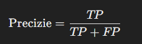
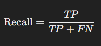
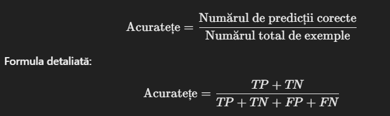
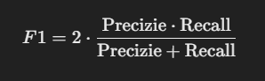

Aceasta documentatie consta in intrebari "generale" din materia ML.
### Ce este invatarea automata supervizata?
Invatarea automata supervizata presupune construirea unui model sau a unei functii ce trebuie antrenat, folosind un set de antrenament, pentru a face predicitii corecte.

### Tipurile de invatare automata supervizata?
Tipurile de invatare automata supervizata sunt urmatoarele: 

- **Regresie**: consta in construirea unei functii continue.
  - Exemple:
    - pretul unei case
    - temperatura intr-o zi

  Y: valori numerice

- **Clasificare**: consta in construirea unei functii discontinue.
  - Exemple:
    - [da; nu]
    - [pisica; caine]
      
 Y: sunt categorii

### Exemple de probleme
- **Probleme de clasificare**:
  - Detectarea spam-ului
  - Detectarea unei boli
  - Recunoasterea unui caine intr-o imagine
- **Probleme de regresie**:
  - Estimarea duratei unei curse de transport
  - Analiza vanzarilor

---

### Ce este invatarea automata nesupervizata?
Invatarea automata nesupervizata presupune construirea unui model fara a folosi seturi de iesire etichetate.

### Cum recunosti problema de invatare automata nesupervizata?
Nu exista seturi de iesire etichetate.

### Tipurile de invatare automata nesupervizata?
Tipurile de invatare automata nesupervizata sunt urmatoarele: 
- **Clustering**: consta in gasirea unor structuri intr-un set de date neetichetat.
- **Reducerea dimensionalitatii**: consta in reducerea numarului de atribute dintr-un set de date, pastrand cat mai mult posibil informatia.

### Exemple de probleme 
- **Probleme de clustering**:
  - Clasificarea articolelor de stiri pe subiecte
  - Gruparea clientilor pe baza comportamentului lor
- **Probleme de reducere dimensionalitatii**:
  - Compresia imaginilor
  - Vizualizarea datelor complexe

---

### Ce este clasificarea?
Clasificarea presupune crearea unui model ce poate asocia fiecare instanta unei categorii sau a unui grup.

### Cum recunosti problema de clasificare?
- Iesirile Y sunt grupuri predefinite.
- Setul contine etichete pentru antrenare.
- Invatarea unei functii discontinue care sa prezica clase.

---

### Ce este o instanta?
Instanta este o unitate de date dintr-un set de date care contin valori pentru toate atributele.

### Exemple de probleme cu instante
Intr-un set de date cu pacienti, fiecare pacient reprezinta o instanta.

---

### Ce este un atribut?
Atributul este un aspect sau o proprietate a bazei de date, masurata pentru fiecare instanta.

### Exemple de probleme cu atribute
Intr-un set de date cu pacienti, caracteristicile precum sexul, varsta, etc. sunt atribute.

---

### Ce e aia o functie target?
Functia target este o functie pe care modelul nostru incearca sa o invete, pentru a prezice corect setul de iesire.

### Exemple de probleme cu functii target
Intr-un set de date cu pacienti, functia construita diagnosticheaza corect un pacient daca are o boala, sau nu, pe baza setului de intrare.

---

### Ce e aia o ipoteza?
**Ipoteza** reprezinta o aproximatie a functiei target.

### Exemple de probleme cu ipoteza
Intr-un set de date cu pacienti, ipoteza poate reprezenta o formula temporara pentru calcularea nivelului de stres.

---

### Ce e aia o Multime de antrenament?
**Multime de antrenament** este un set de date pentru a antrena modelul si contine atat datele de intrare cat si de iesire.

### Exemple de probleme cu Multime de antrenament
Intr-un set de date cu pacienti, multimea de antrenament reprezinta pacienti deja examinati.

---

### Ce e ala zgomot?
**Zgomot-ul** sunt erorile sau datele irelevante (eronate) dintr-un set de date.

### Tipuri de zgomot
- **Zgomot in atribute**: Se refera la instantele dintr-un set de intrari ce contin valori eronate la anumite atribute.
- **Zgomot in eticheta**: Se refera la instantele dintr-un set de iesire ce contin valori eronate la anumite atribute.

### Exemple de probleme cu zgomot
- Intr-un set de date cu pacienti, zgomotul ar putea fi considerat un pacient care la varsta lui are trecut valoarea -10.

---

### Ce e ala Bias?
**Bias-ul** este modul in care modelul invata sa faca o decizie teoretica.

### Tipuri de Bias
- **Bias in arborii de decizie**: Arborii de decizie pot introduce bias prin limitarea adancimii unui arbore sau ignorarea impuritatii unui nod.

### Exemple de probleme cu Bias
- **Setul de date cu pacienti:** Dacă modelul favorizează un anumit gen sau grup de vârstă în diagnostice, aceasta poate fi o manifestare a bias-ului cauzat de un set de date neechilibrat sau de presupuneri implicite ale modelului.

---

### Ce este evaluarea modelului?
Evaluarea unui model presupune măsurarea performanței acestuia pe un set de date separat (de validare sau de testare) pentru a verifica dacă generalizează bine.

### Metode comune de evaluare
- **Măsuri de clasificare**:
  - Precizie, Recalls, Acuratețe, F1-Score.
- **Măsuri de regresie**:
  - Rata medie a erorii pătratice (MSE), Erorile absolute medii (MAE).

---
###  Ce e aia Precizie ?
 **Precizia** :ne ajuta sa aflam din toate cazurile pozitive cate sunt cu adevarat pozitive. 

---

### Ce e ala Recall
 **Recall**:  ne ajuta sa aflam cat de multe instante pozitive au fost identificate ca si corecte de catre model. 

---
###  Ce e aia Acuratete ?
**Acuratețea** (Accuracy) este o măsură a performanței unui model de clasificare, reprezentând proporția predicțiilor corecte din totalul predicțiilor făcute.

*TP* (True Positives): Cazuri pozitive corect clasificate.
*TN* (True Negatives): Cazuri negative corect clasificate.
*FP* (False Positives): Cazuri negative clasificate greșit ca pozitive.
*FN* (False Negatives): Cazuri pozitive clasificate greșit ca negative.

---

###  Ce e ala F1-Score ?

F1-Score este o măsură a performanței care combină precizia și recall-ul într-o singură valoare, utilă în special când clasele sunt dezechilibrate.

---

### Ce este cross-validation?
**Cross-validation** este o tehnică de validare a modelului prin împărțirea datelor în mai multe subseturi (folduri) și utilizarea lor alternativ pentru antrenare și testare. O metodă populară este k-fold cross-validation.

### Avantaje
- Reduce riscul de overfitting sau underfitting.
- Oferă o estimare mai robustă a performanței modelului.

---

### Ce este supra-antrenarea (overfitting)?
Supra-antrenarea apare atunci când un model devine prea complex și învață detalii sau zgomot din setul de antrenament, dar performează slab pe date noi.

### Exemple de supra-antrenare
- **Setul de date cu pacienți:** Dacă un model învață exact cum să diagnosticheze pacienții din setul de antrenament, dar ratează complet diagnosticele pacienților noi.

---

### Ce este sub-antrenarea (underfitting)?
Sub-antrenarea apare când modelul este prea simplu pentru a capta tiparele din datele de antrenament, ducând la performanțe slabe atât pe setul de antrenament, cât și pe cel de testare.

### Exemple de sub-antrenare
- **Setul de date cu pacienți:** Un model care folosește doar media vârstei pacienților pentru a diagnostica bolile va fi sub-antrenat.

---

### Ce este un model generalizat bine?
Un model generalizat bine este capabil să performeze atât pe seturile de date de antrenament, cât și pe cele de testare, captând tiparele esențiale și ignorând zgomotul.

---

### Ce este ala un hiperparametru?
Un **hiperparametru** este un parametru configurabil înainte de antrenarea modelului, cum ar fi rata de învățare sau numărul de noduri într-un strat neuronal.

### Exemple de hiperparametri
- Numărul de folduri în cross-validation.
- Adâncimea maximă a unui arbore de decizie.
- Rata de învățare într-o rețea neuronală.

---

### Ce este ai optimizarea hiperparametrilor?
Optimizarea hiperparametrilor presupune ajustarea acestora pentru a îmbunătăți performanța modelului. Metodele includ:
- Căutarea pe grilă (Grid Search).
- Optimizarea randomizată (Random Search).
- Algoritmi avansați precum TPE (Tree-structured Parzen Estimators).

---

### Exemple de algoritmi de învățare automată
- **Regresie**:
  - Regresia liniară, Regresia polinomială.
- **Clasificare**:
  - SVM (Support Vector Machines), Logistic Regression, K-Nearest Neighbors.
- **Clustering**:
  - K-Means, DBSCAN.
- **Rețele neuronale**:
  - Perceptron, Convolutional Neural Networks (CNN).
